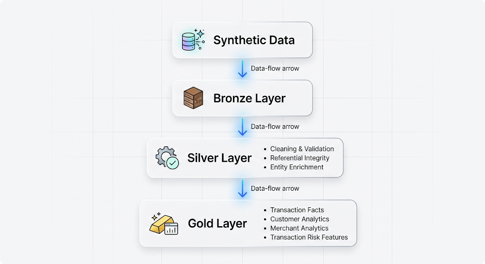

# Apex Financial — Financial Transactions Intelligence

A Spark-based financial data engineering project that simulates how a digital financial-services company can process, validate, enrich, and analyze large-scale transaction data.

The project focuses on practical Apache Spark engineering, including distributed processing, data quality, joins, aggregations, window functions, and performance optimization.

---

## Project Overview

Apex Financial simulates a financial transaction platform processing data across:

- Customers
- Cards
- Devices
- Merchants
- Transactions

The project builds an end-to-end data pipeline that transforms synthetic transaction data into analytics-ready datasets using a **Bronze → Silver → Gold** architecture.

The synthetic data was statistically informed by the **IEEE-CIS Fraud Detection dataset**, allowing the project to maintain realistic transaction distributions and relationships without relying on the original dataset for the processing pipeline.

### Business Objective

Provide a scalable data foundation for transaction intelligence, enabling analysis of:

- Customer transaction behaviour
- Merchant activity and performance
- Transaction volumes and values
- Potential transaction-risk signals
- Transaction patterns at increasing data volumes

The project is primarily focused on **data engineering and Spark**, rather than building a machine-learning fraud detection model.

---

## Architecture

The core pipeline is implemented locally with PySpark and stores intermediate and analytical datasets as Parquet.

### Key Capabilities
- Synthetic financial transaction data generation
- Explicit Spark schemas and Parquet ingestion
- Bronze, Silver, and Gold data layers
- Data cleaning, deduplication, and validation
- Referential-integrity checks across entities
- Multi-table Spark joins and enrichment
- Customer and merchant aggregations
- Window functions for transaction sequencing and timing analysis
- Transaction-risk feature engineering
- Spark execution-plan analysis
- Broadcast joins, partitioning, caching, and data-skew experiments
- Performance testing from 100K to 10M transactions

### Technology Stack

<table style="width: 100%; border-collapse: collapse; font-family: sans-serif; margin: 20px 0;">
  <thead>
    <tr style="background-color: #f2f2f2; border-bottom: 2px solid #dddddd;">
      <th style="padding: 12px; text-align: left; font-weight: bold;">Technology</th>
      <th style="padding: 12px; text-align: left; font-weight: bold;">Purpose</th>
    </tr>
  </thead>
  <tbody>
    <tr style="border-bottom: 1px solid #dddddd;">
      <td style="padding: 12px; font-weight: bold; color: #333;">Python</td>
      <td style="padding: 12px; color: #555;">Data generation and Spark application development</td>
    </tr>
    <tr style="border-bottom: 1px solid #dddddd;">
      <td style="padding: 12px; font-weight: bold; color: #333;">PySpark</td>
      <td style="padding: 12px; color: #555;">Distributed data processing</td>
    </tr>
    <tr style="border-bottom: 1px solid #dddddd;">
      <td style="padding: 12px; font-weight: bold; color: #333;">Apache Spark</td>
      <td style="padding: 12px; color: #555;">Execution engine</td>
    </tr>
    <tr style="border-bottom: 1px solid #dddddd;">
      <td style="padding: 12px; font-weight: bold; color: #333;">Pandas</td>
      <td style="padding: 12px; color: #555;">Supporting data analysis and profiling</td>
    </tr>
    <tr style="border-bottom: 1px solid #dddddd;">
      <td style="padding: 12px; font-weight: bold; color: #333;">NumPy</td>
      <td style="padding: 12px; color: #555;">Synthetic data generation</td>
    </tr>
    <tr style="border-bottom: 1px solid #dddddd;">
      <td style="padding: 12px; font-weight: bold; color: #333;">PyArrow</td>
      <td style="padding: 12px; color: #555;">Parquet/data interoperability</td>
    </tr>
    <tr style="border-bottom: 1px solid #dddddd;">
      <td style="padding: 12px; font-weight: bold; color: #333;">Parquet</td>
      <td style="padding: 12px; color: #555;">Columnar data storage</td>
    </tr>
    <tr style="border-bottom: 1px solid #dddddd;">
      <td style="padding: 12px; font-weight: bold; color: #333;">Jupyter</td>
      <td style="padding: 12px; color: #555;">Data profiling, validation, and Spark experiments</td>
    </tr>
    <tr style="border-bottom: 1px solid #dddddd;">
      <td style="padding: 12px; font-weight: bold; color: #333;">Git</td>
      <td style="padding: 12px; color: #555;">Version control</td>
    </tr>
  </tbody>
</table>

